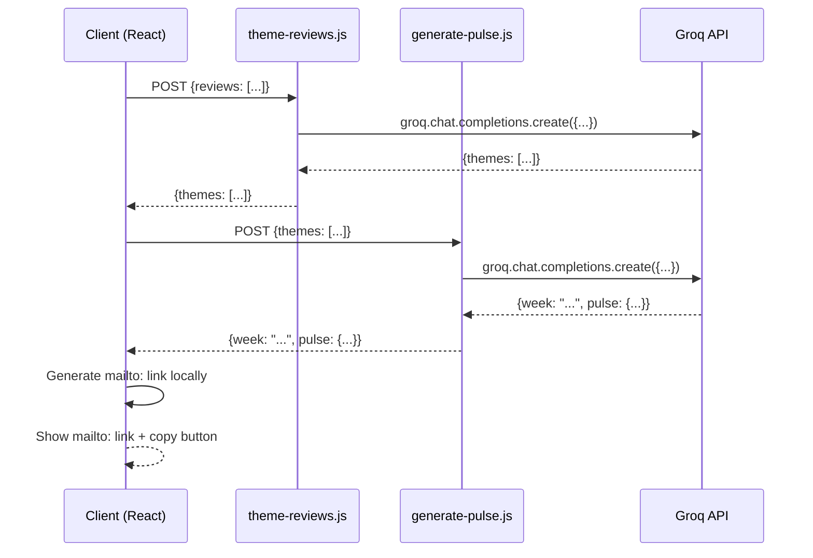

# Architecture Plan: Groww App Review Insights Analyser

## Architecture Summary

### System Overview
A single-page React application that transforms Groww app review CSV data into actionable weekly pulse insights through AI analysis and automated Gmail draft creation.

### Frontend Architecture
- **Framework**: React 18 with functional components and hooks
- **Build Tool**: Vite for fast development and optimized builds
- **Styling**: Tailwind CSS utility-first approach with inline classes
- **State Management**: Local React state with 4-step stepper pattern (idle → themed → pulsed → drafted)
- **File Processing**: PapaParse for client-side CSV parsing
- **UI Pattern**: Progressive disclosure - each step unlocks the next action

### Backend Architecture
- **Platform**: Vercel serverless functions (Node.js runtime)
- **API Design**: RESTful POST endpoints with JSON request/response
- **AI Integration**: Groq SDK with llama-3.3-70b-versatile model using JSON mode
- **Email Service**: Frontend-only mailto: links with clipboard copy functionality
- **Processing Pipeline**: Two-stage AI analysis (theming → pulse generation)

### Data Flow Architecture
1. **Input Layer**: CSV file upload with schema validation (date, rating, title, review_text, platform)
2. **Processing Layer**: Sequential AI calls with structured JSON responses
3. **Presentation Layer**: Component-based UI with loading/error states
4. **Integration Layer**: Frontend mailto: handoff for email draft creation

### Security & Production Considerations
- **API Key Management**: Server-side environment variables only (GROQ_API_KEY)
- **Error Handling**: Structured error responses, no stack traces to client
- **PII Protection**: No personal data fields in CSV schema or AI prompts
- **Rate Limiting**: Implicit through Vercel's serverless function limits
- **Input Validation**: Schema validation on all API endpoints

## Folder Structure

### Project Organization
```
groww-pulse/
├── api/                          # Backend: Vercel serverless functions
│   ├── theme-reviews.js          # POST endpoint: CSV reviews → themed analysis
│   └── generate-pulse.js         # POST endpoint: themes → weekly pulse summary
├── src/                          # Frontend: React application
│   ├── components/               # Reusable UI components
│   │   ├── CSVUploader.jsx       # File upload component with PapaParse integration
│   │   ├── ThemesView.jsx        # Display 5 themed analysis cards with sentiment
│   │   ├── PulseView.jsx         # One-page pulse layout with themes and actions
│   │   └── EmailHandoff.jsx      # mailto link + copy button
│   ├── lib/                      # Shared utilities and configuration
│   │   ├── api.js                # HTTP client wrappers for all API endpoints
│   │   └── prompts.js            # Groq AI prompt templates (theming + pulse)
│   ├── App.jsx                   # Main application: 4-step stepper state machine
│   ├── main.jsx                  # React entry point
│   └── index.css                 # Tailwind CSS directives and base styles
├── public/                       # Static assets
│   └── sample_reviews.csv        # Demo CSV file for testing (copy of groww_reviews.csv)
├── .env.example                  # Environment variable template
├── .gitignore                    # Git ignore patterns
├── package.json                  # Dependencies and scripts
├── vite.config.js                # Vite build configuration
├── tailwind.config.js            # Tailwind CSS configuration
├── vercel.json                   # Vercel deployment configuration
└── README.md                     # Project documentation
```

### Component Responsibilities
- **CSVUploader**: Handles file selection, PapaParse parsing, basic validation
- **ThemesView**: Renders 5 theme cards with sentiment indicators and review counts
- **PulseView**: One-page summary layout with top themes, quotes, and action ideas
- **EmailHandoff**: Renders pulse as formatted plain text. Provides two actions: (a) 'Open in Gmail' button using mailto: link with subject 'Groww Weekly Pulse — [week]' and body pre-filled, (b) 'Copy to clipboard' button using navigator.clipboard.writeText.
- **App.jsx**: Orchestrates the 4-step flow with state management and error handling

## Data Flow Diagram

### Complete User Journey
```mermaid
graph TD
    A[User uploads CSV] --> B[CSVUploader Component]
    B --> C[PapaParse Validation]
    C --> D{Valid CSV?}
    D -->|No| E[Show Error: "Could not read CSV file"]
    D -->|Yes| F[POST /api/theme-reviews]
    F --> G[Server: Schema Validation]
    G --> H[Groq API: Theming Analysis]
    H --> I{Valid JSON Response?}
    I -->|No| J[Return 502: "AI analysis failed"]
    I -->|Yes| K[ThemesView Component]
    K --> L[Display 5 Theme Cards]
    L --> M[User: "Generate Pulse"]
    M --> N[POST /api/generate-pulse]
    N --> O[Groq API: Pulse Generation]
    O --> P{Valid JSON Response?}
    P -->|No| Q[Return 502: "AI analysis failed"]
    P -->|Yes| R[PulseView Component]
    R --> S[One-Page Pulse Layout]
    S --> T[User: "Create Email Draft"]
    T --> U[EmailHandoff Component]
    U --> V[Generate mailto: link locally]
    V --> W{mailto Generated?}
    W -->|No| X[Show Error: "Could not generate email link"]
    W -->|Yes| Y[EmailHandoff Success]
    Y --> Z[Show mailto: Link + Copy Button]
```

### API Contract Flow


## Build Phase Plan

### Phase 1: Project Scaffold + CSV Upload + Display
**Objective**: Establish foundation and basic file processing
- Initialize Vite + React 18 + Tailwind CSS project structure
- Create all required directories (api/, src/components/, src/lib/, public/)
- Set up package.json with dependencies: react, react-dom, @vitejs/plugin-react, tailwindcss, papaparse
- Configure vite.config.js and tailwind.config.js
- Implement CSVUploader.jsx component with file input and PapaParse integration
- Create basic App.jsx with 4-step stepper state machine (idle state only)
- Add simple review display table to verify CSV parsing
- Copy groww_reviews.csv to public/sample_reviews.csv for demo
- Set up .env.example with required environment variables

### Phase 2: Theming Endpoint + ThemesView Component
**Objective**: AI-powered review analysis and display
- Create api/theme-reviews.js serverless function with Groq SDK integration
- Add prompts.js with theming analysis prompt template
- Implement JSON parsing with error handling using Groq JSON mode
- Create ThemesView.jsx component with 5 theme cards layout
- Add sentiment indicators (negative/mixed/positive) with color coding
- Implement loading states and error handling for theming API call
- Connect stepper state transition: idle → themed
- Add review count display and sample review snippets

### Phase 3: Pulse Generation Endpoint + PulseView Component
**Objective**: Weekly pulse summary generation and display
- Create api/generate-pulse.js serverless function
- Add pulse generation prompt to prompts.js
- Implement PulseView.jsx one-page layout component
- Display top 3 themes with rankings and user quotes
- Render 3 actionable ideas section
- Add week header display from API response
- Implement loading states for pulse generation
- Connect stepper state transition: themed → pulsed
- Add responsive design for mobile/desktop viewing

### Phase 4: mailto Handoff + Clipboard Copy
**Objective**: Frontend-only email draft creation
- Create EmailHandoff.jsx component with mailto: link generation
- Implement clipboard copy functionality for email content
- Add pre-filled subject and body from pulse data
- Handle USER_GMAIL_ADDRESS environment variable as default recipient
- Connect final stepper state transition: pulsed → drafted
- Add comprehensive error handling for mailto: generation
- Test end-to-end flow from CSV to mailto: link

## Open Questions & Decisions

### Email Handoff Strategy
**Decision**: Use frontend-only mailto: links with clipboard copy. No backend email integration required. USER_GMAIL_ADDRESS is optional and only used as default recipient.

### Sample Data Strategy
**Decision**: Use the existing groww_reviews.csv in the project root. Copy it to public/sample_reviews.csv during Phase 1 scaffolding for demo purposes and testing.

### Error Message Strategy
**Decision**: Three generic user-facing strings are sufficient for production:
- "Could not read CSV file" (frontend validation errors)
- "AI analysis failed, please try again" (Groq API failures)
- "Could not create email link" (mailto generation failures)

**Implementation**: Log the actual error server-side for debugging, never expose stack traces or internal error details to the client. For email step, all errors are handled client-side.

### Data Validation Requirements
**Decision**: Implement schema validation on both frontend and backend:
- Frontend: Basic CSV structure validation before API calls
- Backend: Full schema validation with required fields (date, rating, title, review_text, platform)
- Rating validation: Must be integer 1-5
- Platform validation: Must be "Play Store" or "App Store"

## Environment Variables Checklist

### Required for Vercel Deployment
- `GROQ_API_KEY`: Groq API access key (server-side only)
- `USER_GMAIL_ADDRESS`: Optional default recipient for mailto: links

### Optional Development Variables
- `NODE_ENV`: Set to "development" for local debugging
- `VERCEL_ENV`: Automatically set by Vercel (development/preview/production)

### Security Notes
- Never reference GROQ_API_KEY in frontend code
- Never log or expose API keys in error messages
- Use Vercel's environment variable encryption for production secrets
- Validate USER_GMAIL_ADDRESS format before using in mailto: links

## Technical Specifications

### Component Architecture Details

#### CSVUploader.jsx
**Props**: None (self-contained)
**State**: 
- `file`: Selected file object
- `isLoading`: Boolean for upload state
- `error`: String for error messages
**Methods**:
- `handleFileSelect()`: File input change handler
- `parseCSV()`: PapaParse integration with validation
- `validateSchema()`: CSV structure validation
**Validation Rules**:
- Must have columns: date, rating, title, review_text, platform
- Rating must be 1-5 integer
- Platform must be "Play Store" or "App Store"
- Date format: YYYY-MM-DD

#### ThemesView.jsx
**Props**: `themes` (array), `isLoading` (boolean), `error` (string)
**State**: None (controlled component)
**Features**:
- 5 theme cards in responsive grid
- Sentiment color coding (red/yellow/green)
- Review count badges
- Sample review snippets (15 words max)
- Loading skeleton during API call

#### PulseView.jsx
**Props**: `pulse` (object), `week` (string), `isLoading` (boolean), `error` (string)
**Layout Structure**:
- Header: Week display
- Top 3 themes with rankings and user quotes
- 3 action ideas in bullet list
- Export-ready formatting

#### EmailHandoff.jsx
**Props**: `pulse` (object), `onSuccess` (function)
**State Management**:
- `isCopying`: Clipboard operation state
- `error`: Error message display
- `mailtoLink`: Generated mailto: URL
- `emailContent`: Formatted email body for clipboard
**Email Generation**:
- Format pulse data into email subject and body
- Generate mailto: URL with proper encoding
- Handle clipboard copy with fallback messaging
- Truncate body if over 2000 characters for mailto: URL limits

### Data Contracts

**NOTE**: Groq supports JSON mode via response_format. Both theming and pulse calls MUST pass response_format: { type: 'json_object' } to guarantee valid JSON.

### API Endpoint Specifications

#### POST /api/theme-reviews
**Request Body**:
```json
{
  "reviews": [
    {
      "date": "2025-04-16",
      "rating": 3,
      "title": "App crash issue",
      "review_text": "The app crashes when I try to open portfolio...",
      "platform": "Play Store"
    }
  ]
}
```
**Response Body**:
```json
{
  "themes": [
    {
      "id": "theme_1",
      "name": "App Performance",
      "description": "Users reporting crashes and slow loading",
      "review_count": 12,
      "sentiment": "negative",
      "sample_reviews": ["The app crashes when...", "Slow loading times..."]
    }
  ]
}
```
**Error Responses**:
- 400: Invalid request format
- 500: Server error
- 502: Groq API parsing failure

#### POST /api/generate-pulse
**Request Body**:
```json
{
  "themes": [
    {
      "id": "theme_1",
      "name": "App Performance",
      "description": "Users reporting crashes and slow loading",
      "review_count": 12,
      "sentiment": "negative"
    }
  ]
}
```
**Response Body**:
```json
{
  "week": "Apr 16 - Apr 22, 2025",
  "pulse": {
    "top_themes": [
      {
        "rank": 1,
        "name": "App Performance",
        "description": "Crashes and loading issues",
        "review_count": 12,
        "sentiment": "negative",
        "user_quote": "The app keeps crashing when I open my portfolio"
      }
    ],
    "action_ideas": ["Fix crash issues", "Optimize loading speed", "Add error handling"]
  }
}
```

#### Email Handoff (Frontend Only)
**mailto: Link Format**:
```
mailto:recipient@example.com?subject=Weekly%20Pulse%20Report&body=Top%20themes%20and%20action%20ideas...
```
**Clipboard Copy**: Full email content formatted for easy pasting

### Data Models & Validation

#### CSV Review Schema
```javascript
const reviewSchema = {
  date: { type: 'string', format: 'YYYY-MM-DD', required: true },
  rating: { type: 'integer', min: 1, max: 5, required: true },
  title: { type: 'string', maxLength: 200, required: true },
  review_text: { type: 'string', maxLength: 2000, required: true },
  platform: { type: 'string', enum: ['Play Store', 'App Store'], required: true }
}
```

#### Theme Response Schema
```javascript
const themeSchema = {
  id: { type: 'string', pattern: '^theme_[0-9]+$', required: true },
  name: { type: 'string', maxLength: 50, required: true },
  description: { type: 'string', maxLength: 100, required: true },
  review_count: { type: 'integer', min: 1, required: true },
  sentiment: { type: 'string', enum: ['negative', 'mixed', 'positive'], required: true },
  sample_reviews: { type: 'array', maxItems: 3, items: { type: 'string', maxLength: 100 } }
}
```

## Testing Strategy

### Unit Testing Requirements
**Frontend Components**:
- CSVUploader: File parsing, validation, error handling
- ThemesView: Theme rendering, sentiment display, loading states
- PulseView: Layout rendering, data formatting
- EmailDraftButton: MCP integration, error states

**Backend Functions**:
- API input validation
- Claude API response parsing
- Error handling and logging
- MCP response extraction

### Integration Testing
**End-to-End Flows**:
1. CSV upload → Theme generation → Display
2. Theme generation → Pulse creation → Display
3. Pulse creation → Gmail draft → Success
4. Error scenarios at each step

**API Testing**:
- Request/response validation
- Error response formats
- Rate limiting behavior
- Timeout handling

### Performance Testing
**Load Testing**:
- Concurrent CSV uploads (10+ users)
- Claude API response times (< 30 seconds)
- Gmail MCP integration reliability

**Frontend Performance**:
- Bundle size optimization (< 1MB)
- First Contentful Paint (< 2 seconds)
- Interaction responsiveness (< 100ms)

### Quality Gates
**Code Quality**:
- ESLint configuration with React rules
- Prettier formatting for consistency
- Component complexity limits (< 150 lines)
- Test coverage minimum (80%)

**Security Validation**:
- No API keys in client code
- Input sanitization on all endpoints
- HTTPS enforcement in production
- CSP headers configuration

## Deployment Pipeline

### Vercel Configuration
**vercel.json**:
```json
{
  "functions": {
    "api/theme-reviews.js": {
      "maxDuration": 30
    },
    "api/generate-pulse.js": {
      "maxDuration": 30
    },
  },
  "env": {
    "GROQ_API_KEY": "@groq-api-key",
    "USER_GMAIL_ADDRESS": "@user-gmail-address"
  }
}
```

### Environment Management
**Development**:
- Local `.env` file with API keys
- Vite dev server with HMR
- Mock data for testing

**Preview**:
- Automatic deployment on PR
- Staging environment variables
- Integration test execution

**Production**:
- Manual approval for main branch
- Production environment variables
- Full test suite execution
- Performance monitoring enabled

### CI/CD Pipeline
**GitHub Actions Workflow**:
1. **Lint & Format**: ESLint + Prettier
2. **Unit Tests**: Jest + React Testing Library
3. **Build**: Vite production build
4. **Deploy Preview**: Vercel preview deployment
5. **Integration Tests**: Playwright E2E tests
6. **Production Deploy**: Manual approval to Vercel prod

## Performance Optimization

### Frontend Optimization
**Bundle Optimization**:
- Code splitting by route
- Dynamic imports for heavy components
- Tree shaking for unused dependencies
- Minification and compression

**Runtime Optimization**:
- React.memo for component memoization
- useMemo for expensive calculations
- Debounced file uploads
- Optimistic UI updates

### Backend Optimization
**Serverless Functions**:
- Cold start optimization
- Memory usage monitoring
- Timeout configuration
- Error retry logic

**API Optimization**:
- Response caching where appropriate
- Request payload size limits
- Streaming for large CSV files
- Connection pooling for Claude API

### Monitoring & Observability
**Frontend Monitoring**:
- Error tracking (Sentry)
- Performance metrics (Web Vitals)
- User interaction analytics
- A/B testing framework

**Backend Monitoring**:
- Function execution metrics
- Claude API usage tracking
- Gmail MCP success rates
- Error rate monitoring

**Alerting**:
- API response time > 30 seconds
- Error rate > 5%
- Gmail MCP failures > 10%
- Frontend error spikes

## Production Readiness Checklist

### Pre-Launch
- [ ] All unit tests passing (80%+ coverage)
- [ ] Integration tests for all user flows
- [ ] Performance benchmarks met
- [ ] Security audit completed
- [ ] Environment variables configured
- [ ] Error monitoring setup
- [ ] Documentation completed

### Post-Launch
- [ ] User acceptance testing
- [ ] Load testing with realistic traffic
- [ ] Backup and recovery procedures
- [ ] Incident response plan
- [ ] User feedback collection
- [ ] Performance monitoring alerts
- [ ] Regular security updates

## Decisions Log

**2026-04-23** — Stack pivot from Anthropic to Groq. Original architecture specified Claude Sonnet + Gmail MCP for automated draft creation. Pivoted to Groq (Llama 3.3 70B) + mailto handoff due to API cost constraints on a portfolio project. Production version would swap back to Claude + Gmail MCP for seamless automation. All response contracts remain unchanged to keep the pivot reversible.
